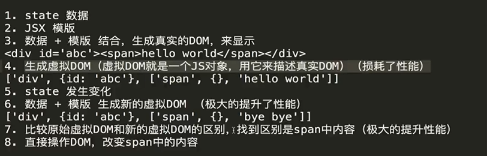
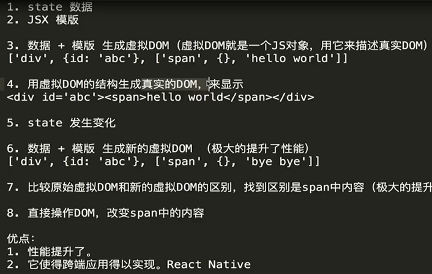
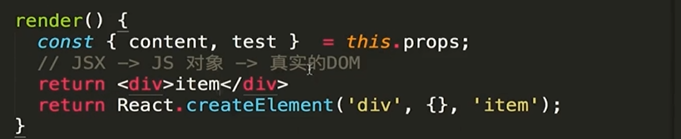

# ReactDemo
React 一些基本的用法 双向绑定 组件化 路由 视图层的框架（更有利于前端自动化测试）等

## 用的知识点
React 的组件化中 父组件通过属性传递数组到子组件 子组件通过父组件属性传递过来的方法 调用父组件的方法。

组件与子组件的数据传输 父组件通过属性值传递数组给子组件 同时父元素也可以通过属性传递一个自己的方法 注意绑定this 子组件通过调用父组件的方 操作数据法

react 的一些优化 比如this.setState()可以传一个函数进去 this的指定初始化应该放在前面 {}花括号的的结构赋值等

父组件可以向子组件传值 但是子组件不能直接修改传到的值 （单向数据流概念）

propTypes 子组件要求父组件的传值类型 做限制

defaultProps 给子组件数据设置默认值 防止父组件不传出现报错

## 虚拟DOM

1.state 数据  
2.JSX 模板   
3.数据 + 模板 结合，生成真正的DOM，来显示  
4.state 发生改变  
5.数据 + 模板 结合 ，生成真正的DOM，替换原始的DOM  

### 缺陷：
第一次生成了一个完整的DOM片段  
第二次生成一个完整DOM片段  
第二次的DOM替换第一次的DOM，非常耗性能  

### 改良
1.state 数据  
2.JSX 模板   
3.数据 + 模板 结合，生成真正的DOM，来显示  
4.state 发生改变  
5.数据 + 模板 结合 ，生成真正的DOM，并不直接替换原始的DOM  
6.新的DOM (DoucumentFragment(内存里)) 和原始的DOM 做对比，找差异  
7.找出新的DOM发生的变化  
8.只用新的DOM的变化内容，替换掉老的DOM的旧内容  

缺陷：  
性能提升不明显  

### 虚拟DOM

### 虚拟DOM实际底层代码执行

### 虚拟DOM实现的原理

### 虚拟DOM diff算法 首层比对  key值比对 循环key要谨慎 key 最好不要用index

### react中通过ref来操作DOM节点 但是要注意与setState函数执行时异步的问题 导致获取的DOM节点的不正确

# 生命周期函  
*  生命周期函 数是指在某一时刻组件会自动调用执行的函数
*  shouldComponentUpdate 避免被重复多次无谓的渲染

#  redux
###  工作原理

*  建立store  
*  redux 是传递数据一个框架
*  Components相当于借书者
*  Action 相当于你说借什么书
*  Store 相当于图书管理员
*  Reducers 相当于书籍登录册
*  actionType的拆分有利于项目管理 不会出现莫名的错误
*  使用actionCreators 来创建action 有利于业务逻辑的的

*   store 是唯一
*   只有store 能够改变自己的内容
*   reducer 是纯函数(纯函数指的是，给定固定的输入，就会有固定的输出，而去不会有副作用)

#  组件的拆分
*  UI组件做渲染
*  容器组件负责里面的逻辑 关注业务逻辑
*  无状态组件 (只有render函数的 可以用无状态组件替换掉普通组件) 性能更高 本质就是个函数 普通组件还包换生命周期